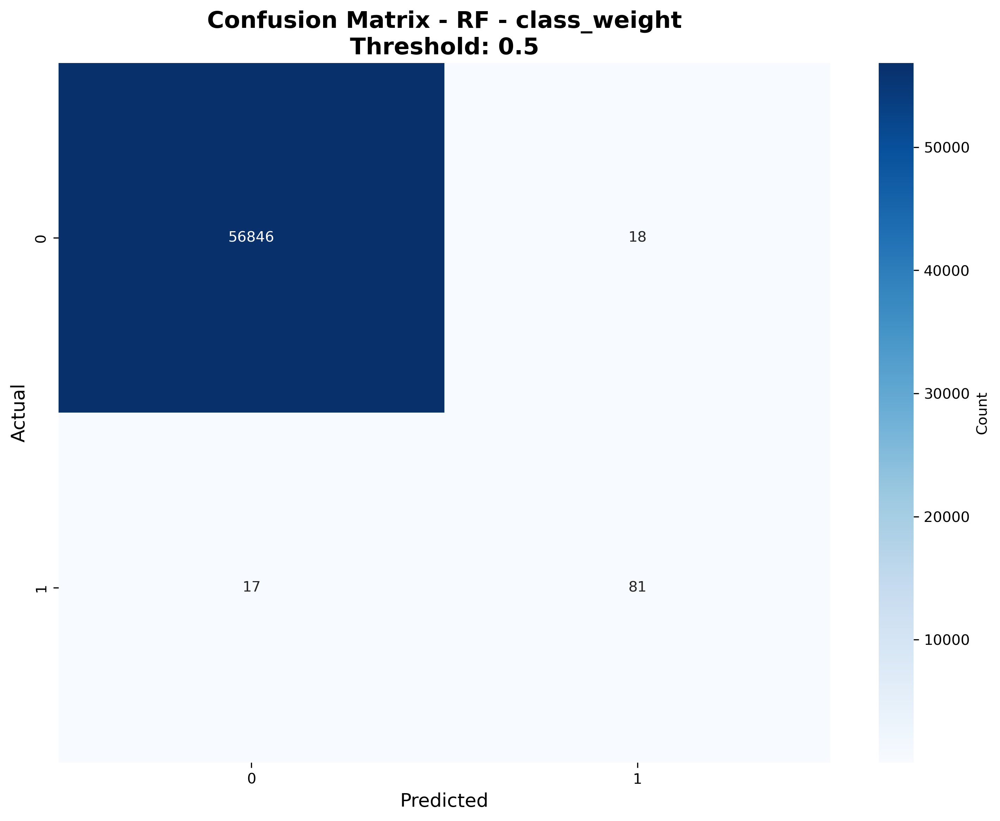
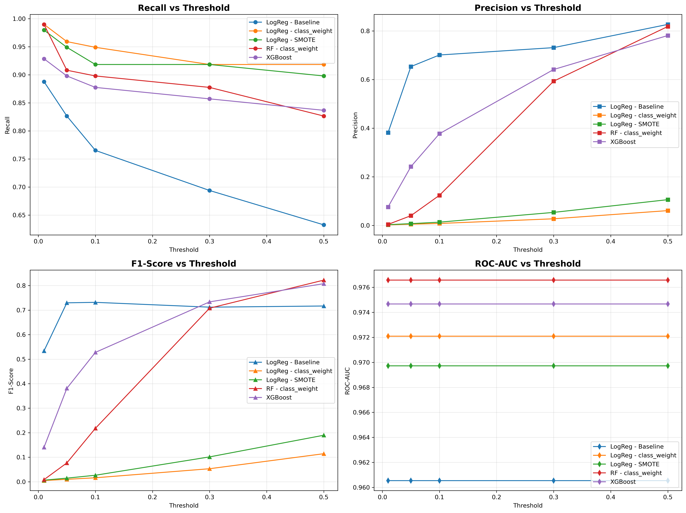

# 🔒 Detecção de Fraude em Cartão de Crédito

Modelo de Machine Learning que identifica transações fraudulentas em uma base extremamente desbalanceada (**0,17% de fraudes**), com rastreamento de experimentos no MLflow e interface Streamlit para testar transações individualmente ou em lote.

## Resultado

Random Forest com `class_weight='balanced'`, avaliado em 56.962 transações de teste (20%, split estratificado):

| Métrica | Valor | O que significa |
|---|---|---|
| **Recall** | 82,7% | 81 das 98 fraudes do teste foram detectadas |
| **Precision** | 81,8% | de cada 100 alertas, cerca de 82 são fraudes reais |
| **ROC-AUC** | 0,977 | boa separação entre fraude e transação legítima |
| **Falsos positivos** | 18 | em 56.864 transações legítimas (0,03%) |



> Por que não usar acurácia? Um modelo que diz "nunca é fraude" teria 99,83% de acurácia e não pegaria nenhuma fraude. Por isso o foco está em recall, precision e PR-AUC.

## Como foi feito

1. **Dados:** [Credit Card Fraud Detection (Kaggle)](https://www.kaggle.com/datasets/mlg-ulb/creditcardfraud): 284.807 transações, features V1–V28 já anonimizadas por PCA, mais `Time` e `Amount`.
2. **Split estratificado 80/20** antes de qualquer transformação.
3. **Desbalanceamento:** comparei `class_weight='balanced'` e SMOTE. O SMOTE fica **dentro do `Pipeline`**, então só é aplicado no treino, sem vazar dados sintéticos para o teste.
4. **Modelos:** Regressão Logística (baseline, `class_weight` e SMOTE), Random Forest (`class_weight`) e XGBoost (`scale_pos_weight`).
5. **Thresholds:** cada modelo testado em 0,01 / 0,05 / 0,1 / 0,3 / 0,5, com todas as execuções registradas no MLflow.
6. **Escolha:** Random Forest com `class_weight`, no threshold 0,5, que teve o melhor F1.



## Limitações e próximos passos

- O threshold foi escolhido no conjunto de teste. O correto é separar um conjunto de validação para essa escolha e usar o teste só uma vez, no final.
- Adicionar explicabilidade com SHAP para justificar cada alerta.
- Transformar a predição em API (FastAPI) e publicar a interface.

## Como rodar

```bash
git clone https://github.com/edudatalytics/credit-card-fraud-detection.git
cd credit-card-fraud-detection
pip install -r requirements.txt
```

Baixe `creditcard.csv` do Kaggle e coloque em `data/creditcard.csv`. Depois:

```bash
cd Analise
python credit_card_fraud_analysis.py   # treina, compara modelos e registra no MLflow
mlflow ui                              # ver experimentos e registrar o melhor modelo
cd ..
streamlit run app.py                   # interface
```

## Estrutura

```
credit-card-fraud-detection/
├── Analise/
│   ├── credit_card_fraud_analysis.py   # treino, comparação e MLflow
│   ├── artifacts/feature_columns.pkl
│   └── plots/                          # matriz de confusão e comparação
├── app.py                              # interface Streamlit
├── predict.py                          # carrega o modelo do MLflow Model Registry
└── requirements.txt
```

## Stack

Python · Pandas · Scikit-learn · Imbalanced-learn (SMOTE) · XGBoost · MLflow · Streamlit · Matplotlib · Seaborn

---

**Eduardo Matos** · [LinkedIn](https://www.linkedin.com/in/matos-eduardo) · [GitHub](https://github.com/edudatalytics)
